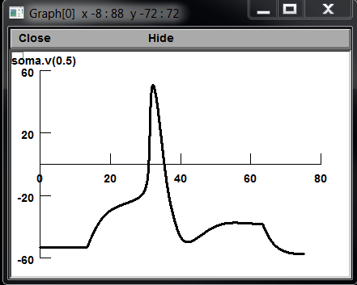
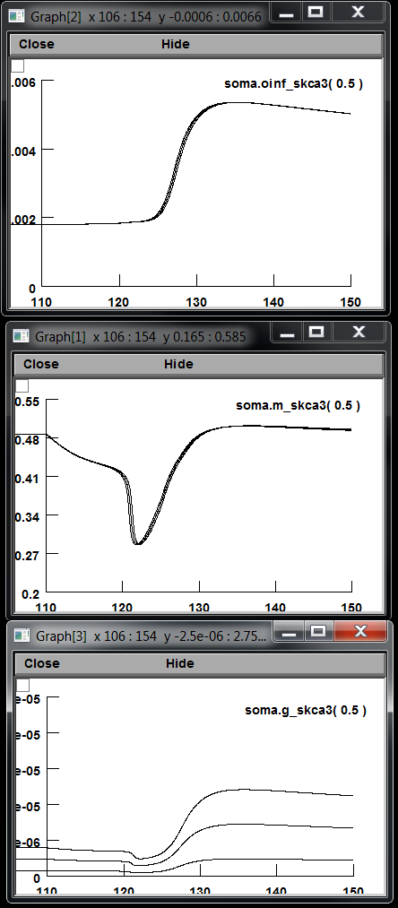

### README for Bladder Small DRG Neuron Soma Model (Mandge and Manchanda, 2018)

#### Reference

[A biophysically detailed computational model of urinary bladder small DRG neuron soma- Mandge and Manchanda, 2018. PLOS Computational Biology, DOI: 10.1371/journal.pcbi.1006293](http://doi.org/10.1371/journal.pcbi.1006293)

#### Abstract

Bladder small DRG neurons, which are putative nociceptors pivotal to urinary bladder function, express more than a dozen different ionic membrane mechanisms: ion channels, pumps and exchangers. Small-conductance Ca2+-activated K+ (SKCa) channels which were earlier thought to be gated solely by intracellular Ca2+ concentration ([Ca]i) have recently been shown to exhibit inward rectification with respect to membrane potential. The effect of SKCa inward rectification on the excitability of these neurons is unknown. Furthermore, studies on the role of KCa channels in repetitive firing and their contributions to different types of afterhyperpolarization (AHP) in these neurons are lacking. In order to study these phenomena, we first constructed and validated a biophysically detailed single compartment model of bladder small DRG soma constrained by physiological data. The model includes twenty-two major known membrane mechanisms along with intracellular Ca2+ dynamics comprising Ca2+ diffusion, cytoplasmic buffering, and endoplasmic reticulum (ER) and mitochondrial mechanisms. Using modelling studies, we show that inward rectification of SKCa is an important parameter regulating neuronal repetitive firing and that its absence reduces action potential (AP) firing frequency. We also show that SKCa is more potent in reducing AP spiking than the large-conductance KCa channel (BKCa) in these neurons. Moreover, BKCa was found to contribute to the fast AHP (fAHP) and SKCa to the medium-duration (mAHP) and slow AHP (sAHP). We also report that the slow inactivating A-type K+ channel (slow KA) current in these neurons is composed of 2 components: an initial fast inactivating (time constant ~ 25-100 ms) and a slow inactivating (time constant ~ 200-800 ms) current. We discuss the implications of our findings, and how our detailed model can help further our understanding of the role of C-fibre afferents in the physiology of urinary bladder as well as in certain disorders.

#### How to run the model

#### Windows based Systems

1. Search for NEURON's mknrndll tool in the Windows start menu and run it. Navigate to the model folder location using the `Choose Directory` option. When you reach the model folder, Click `List Dir` option and then `Make nrnmech.dll`. This compiles all the mod files in this directory.

2. Assuming you're current working directory is the model folder, run `python` or (`python3`) via command prompt (or IDLE/spyder/Jupyter notbook).

3. At the python interpreter type: `import mosinit`. If python-based NEURON is installed, NEURON GUI will appear with a panel for generating graphs. See **Generating Fig 9A and Fig 16A, C, D of the paper** below . If you see an error, check your NEURON installation or download the [latest NEURON version](https://www.neuron.yale.edu/neuron/download/precompiled-installers) and install it with python-based NEURON.

#### Unix based Systems

1. Navigate (change directory) to the model folder in using the terminal. 

2. Compile the mod files by calling `nrnivmodl` from terminal. 

3. At the python (`python` or `python3`) interpreter, type: `import mosinit`. If python-based NEURON is installed, NEURON GUI will appear with a panel for generating graphs. See **Generating Fig 9A and Fig 16A, C, D of the paper** below . If you see an error, check your NEURON installation or download the [latest NEURON version](https://www.neuron.yale.edu/neuron/download/precompiled-installers) and install it with python-based NEURON.

#### For MacOS based Systems

1. Compiling mod files: Follow the instructions given [here](https://www.neuron.yale.edu/neuron/static/docs/nmodl/macos.html).

2. Launch python and at the python interpreter type: `import mosinit`. If python-based NEURON is installed, NEURON GUI will appear with a panel for generating graphs. See **Generating Fig 9A and Fig 16A, C, D of the paper** below . If you see an error, check your NEURON installation or download the [latest NEURON version](https://www.neuron.yale.edu/neuron/download/precompiled-installers) and install it with python-based NEURON.

#### Generating Fig 9A and Fig 16A, C, D of the paper
Below steps are common to all the OS types:

1. Generating, Fig 9A of the paper: cick the `Generate Fig 9A` button which will run the fig9A.hoc file to generate Fig 9A:

2. Generating Fig 16 A, C and D of the paper: lick on the `Quit between different figure simulations` button, restart the simulation and select the other button.

`Generate Fig 16 A, C, D` which will run the file fig16ACD.hoc first with no changes and then running with each of the changes
gbar_skca3 (SKCa Conductance) to 0.0027 and 0.0045 mho/cm2:

NOTE: Restarting between simulation makes sure that the Current Clamp Panel parameters are properly set.
